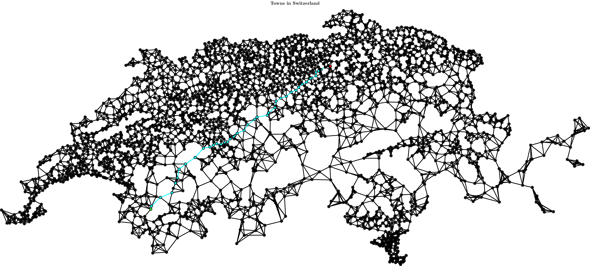

# GraphLib

A simple header-only C++ library that aims to showcase and implement various data structures and algorithms that are based on graph theory.

The code is documented and built using [Travis CI](https://travis-ci.org/):

# Details
## Currently implemented is the following:
### Data structures
- Graph class
  - Storage format
    - Adjacency Matrix
    - Adjacency List
    - conversion between the two
  - Directed/Undirected graphs
  - file input to add edges
  - edges & nodes support individual colours
  - edges & nodes support C++ STL conform iterators
- Initialization
  - YAML input file constructor
  - degree sequence (for undirected graphs)

### Algorithms
- Closure
  - Finding the connected component / transitive closure of a node
- DFS
  - Basic graph traversal
- BFS
  - Basic graph traversal
  - finding vertices at the same distance from source
- Minimum spanning trees
  - Kruskal
- Graph properties
  - general cycle detection
- Shortest Paths
  - Dijkstra (distances + path)
  - Floyd-Warshall (distances + path)
- Node centralities
  - Degree
  - Closeness
  - Harmonic
- Miscellaneous
  - Havel-Hakimi to verify whether a degree sequence is graphic

# Installation
The following software is required:
- C++17
- Cmake
- Make
- Eigen
- MathGL
- lualatex (+ tikz-network package)
- convert (built in on linux)

# Programs in this repository
To build all tests & examples, run `install.sh` from within the root folder of this repository. 
Executables can then be found in the `build/test` and `build/examples` folders.

## Tests
This repository features unit tests in the 'test' folder.

To build a specific test, run `install.sh $1` where `$1` is the name of a test.

Test names can be deduced as follows: `test/Test_Color.cpp` <-> `install.sh Color`

This will create executables in the `build/test` folder for you to run (make sure you navigate into that folder).

Alternatively you can directly build & run all tests by invoking `./test/test.sh` from the root folder.

## Examples
This repository also has a few example programs that demonstrate certain features of the library.

They can be found in the `examples` folder.

Example names can be deduced as follows: `examples/SwitzerlandDijkstra.cpp` <-> `install.sh SwitzerlandDijkstra`

# To-Do list
- Document algorithm purpose in doxygen files
  
Hereafter, the term _finding <sth.>_ stands for some combination of _counting_ and _outputting <sth.>_
## Data structures
- advanced initialization 
  - stream operators
- simple graph support
- multigraph support
- bipartite graphs
- combining and editing graphs post-initialization
- threshold graphs, split graphs
## Algorithms
- BFS
  - power graphs (for undirected graphs)
- Shortest Paths
  - Bellman-Ford
  - Johnson
- Graph properties
  - cycles of specific length (e.g. triad census)
  - eccentricity, radius, diameter
- Minimum spanning trees
  - Prim
  - Total # of spanning trees
- Connectivity
  - Eulerian paths
  - finding all possible walks from source to destination
- Network algorithms
  - Edmonds-Karp
- Cliques
  - cliques of size k
- Huffman tree w/ visualization
- Markov Chain
  - hitting time
  - commute time
  - arrival probability
  - ergodicity
  - stationary distribution
  - reducibility
  - periodicity
- node centralities
  - Betweenness
  - Eigenvector
  - Katz
  - PageRank
- Split graph
  - find constructing degree sequence
  - computing splittance
- Bipartite graphs
  - Testing for bipartiteness
  - 2-coloring
  - vertex cover
